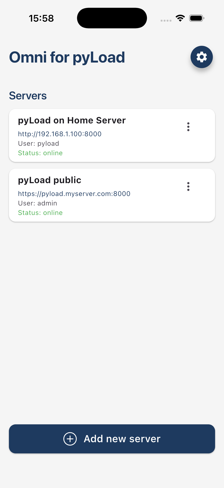
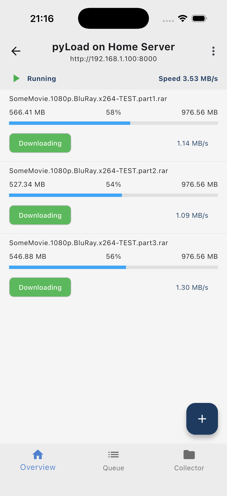
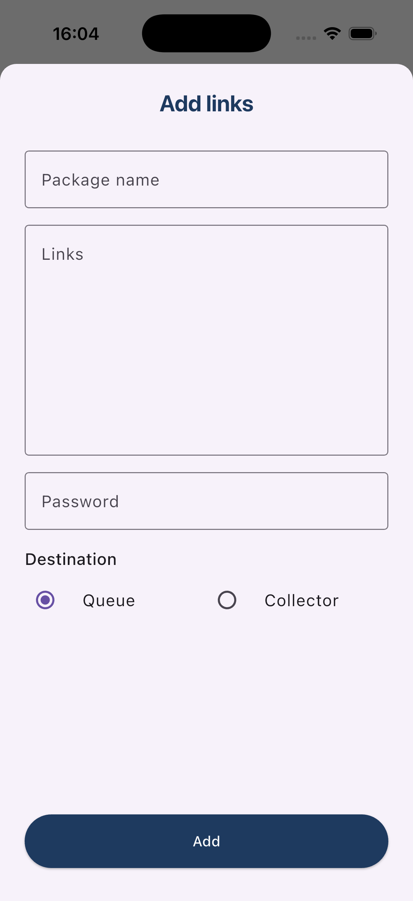
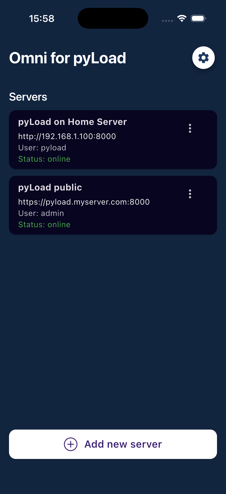
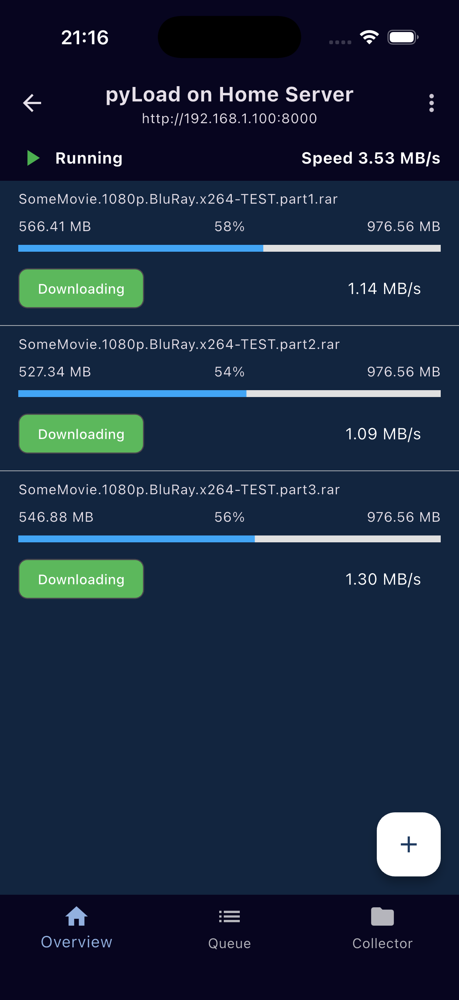
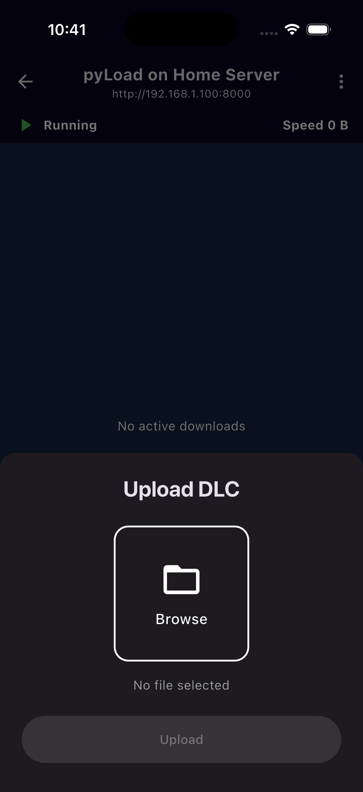

# 

# About Omni

Omni is an app to manage downloads for your [pyLoad](https://github.com/pyload/pyload) instance.
It is available for both Android and iOS.

> [!IMPORTANT]
> This app is currently in alpha. Expect to run into bugs.
If you encounter a bug, check the known issues section first and create 
an [issue](https://github.com/Sab44/omni_for_pyload/issues) if it is not listed there.

> [!WARNING]
> This app requires your pyLoad instance to be on version `0.5.0b3.dev94` or newer.

## Screenshots

  

    
    
    
    
    
    
  

## Support development

A lot of work has gone into building this app. It is provided for free and open-souce. If you like it, please consider donating to support the development.  

|     |     |
|-----|-----|
|  |  |

Another one 

<table border="0" cellpadding="0" cellspacing="0">
  <tr>
    <td align="center"></td>
    <td align="center"></td>
  </tr>
</table>

## Features

* Manage multiple instances
* Add downloads via links or upload DLC file
* See active downloads & packages in Queue and Collector
* Stop, pause and resume Queue
* Delete one or multiple packages from Queue or Collector
* Move packages between Queue and Collector
* Restart packages
* Trigger package extraction
* Clear finished packages
* Restart failed packages
* Light and dark mode

## Click'N'Load

⚠️ ANDROID ONLY  

The app supports adding downloads via Click'N'Load. You can start the service via the `+` button once you selected a server and configured your Click'N'Load settings. Due to background limitations on iOS this is only available for Android. This is an experimental feature and might not work reliably.

## Installation

### Android

Recommended: install via Obtanium  
// add Obtanium button with redirect function  
Alternatively, install the APK from the releases section manually.

### iOS

Recommended: install via AltStore  
// add AltStore logo and instructions after making it available on AltStore  
Alternatively, install the IPA from the releases section manually (e.g. via Sideloadly).

## Known limitations

* Password is currently not encrypted when stored on device

## Roadmap

* Improve error handling
* Allow uploading dlc files straight to queue
* Allow editing a server after it has been added
* Support managing pyLoad server settings from the app
* Show estimated time left for downloads
* Allow receiving URLs via the share action
* Allow receiving dlc files via the share action

## Contributing

This is a flutter project, written in Dart and Kotlin (for the Android service).  
Contributions are welcome. Make sure they are well tested and unit tests are adapted if feasible.
